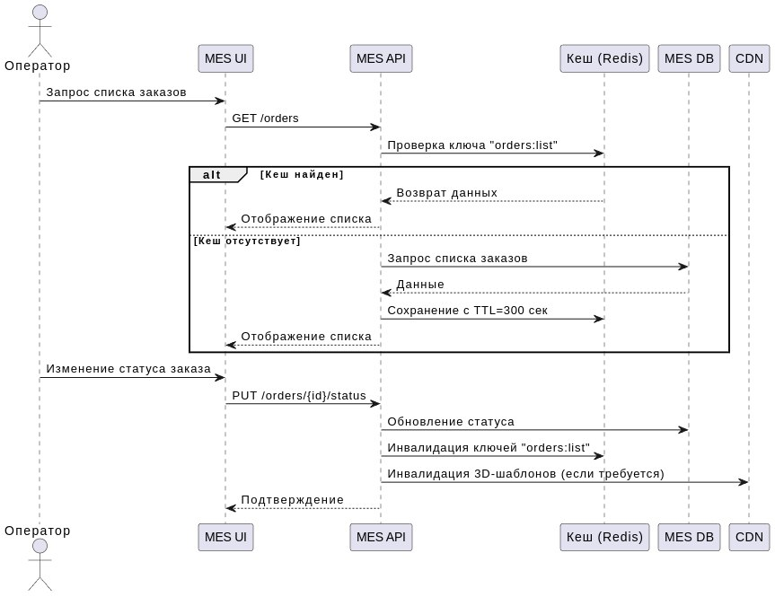

# Архитектурное решение по кешированию

## 1. Мотивация

### Проблемы:

* Низкая скорость интерфейса MES: Операторы тратят 30-40 секунд на загрузку страниц с данными о заказах.
* Задержки в обработке заказов: Среднее время выполнения заказа — 2 часа (при целевом SLA 1 час).
* Высокая нагрузка на MES DB: 80% запросов к БД — повторяющиеся SELECT для одних и тех же данных.

### Цели:

* Сократить время загрузки страниц MES до 5 секунд.
* Уменьшить нагрузку на БД на 60%.
* Повысить скорость обработки заказов на 30%.

### Объекты для кеширования:

| Компонент  | Данные                          | Частота запросов |
| ---------- | ------------------------------- | ---------------- |
| MES API    | Статусы заказов, метаданные     | 1500 RPM         |
| MES DB     | Справочники (операторы, станки) | 500 RPM          |
| 3D Storage | Шаблоны 3D-моделей              | 200 RPM          |


## 2. Предлагаемое решение

* Тип кеширования: Серверное (на уровне MES API и MES DB).
* Почему не клиентское:
* * Данные динамические (статусы заказов меняются каждые 5-10 минут).
* * Нет контроля над клиентскими устройствами (у операторов старые ПК).

### Паттерны:

#### 1. Cache-Aside (Lazy Loading)
Применение: Кеширование данных о заказах и справочников.
Причины выбора:

Простота реализации: кеш заполняется только при запросе данных.

Эффективен для данных с редкими обновлениями (например, справочники станков).
Пример:

```python
def get_order(order_id):
    data = cache.get(order_id)
    if not data:
        data = db.query("SELECT * FROM orders WHERE id = ?", order_id)
        cache.set(order_id, data, ttl=300)  # TTL 5 минут
    return data
```

#### 2. Refresh-Ahead

* Применение: Шаблоны 3D-моделей (часто используемые, но тяжелые файлы).
* Причины выбора:
* * Предзагрузка данных до истечения TTL, чтобы пользователь не ждал генерации.
* * Критично для 3D-моделей (размер файлов до 500 МБ).

#### 3. Write-Through (для критичных данных)

* Применение: Обновление статусов заказов.
* Причины:
* * Гарантирует актуальность данных в кеше и БД.
* * Избегает рассинхрона при параллельных запросах.
* Почему не Write-Behind/Write-Back:
* * Риск потери данных при сбое кеша (например, если статус заказа не сохранится в БД).


### Пояснение к диаграмме последовательности [(Sequence Diagram)](sequence-diagram.uml):



* Чтение данных: При запросе списка заказов MES API сначала проверяет кеш. Если данные есть — возвращает их, если нет — загружает из БД и кеширует.
* Запись данных: При изменении статуса заказа:
* * Обновляется БД.
* * Удаляются связанные ключи в кеше (orders:list и order:{id}).
* * Если изменение затрагивает 3D-шаблоны, CDN также инвалидируется.

### Стратегия инвалидации кеша

* Выбранная стратегия: Гибридная (TTL + программная инвалидация)
* Компоненты:
* * Программная инвалидация по ключу: Удаление кеша при изменении данных (например, обновление статуса заказа).
* * TTL (временная): Автоматическое удаление устаревших данных через 5 минут.
* Сравнение стратегий:

| Стратегия     | Преимущества                              | Недостатки                                 | Почему не подходит               |
| ------------- | ----------------------------------------- | ------------------------------------------ | -------------------------------- |
| TTL           | Простота, автоматизация                   | Риск устаревших данных                     | Не подходит для частых изменений |
| Программная   | Точечное управление, актуальность         | Сложность реализации, риск пропустить ключ | Требует точной интеграции        |
| Write-Through | Данные всегда актуальны                   | Высокая нагрузка на кеш                    | Замедляет запись                 |
| Refresh-Ahead | Предзагрузка данных, минимизация задержек | Избыточное использование ресурсов          | Неэффективно для редких запросов |

#### Обоснование выбора гибридного подхода:

* TTL защищает от «зависания» устаревших данных.
* Программная инвалидация гарантирует актуальность при критичных изменениях (например, статус заказа).
* Компромисс: Баланс между производительностью и точностью.


## 3. Схема кеширования

### Компоненты:

* Redis Cluster: Основное хранилище кеша (высокая доступность, поддержка TTL).
* Memcached: Для статических данных (справочники).
* CDN Cloudflare: Для кеширования 3D-файлов на edge-узлах.

### Интеграция с системой:

* MES API первым обращается к Redis за данными о заказе.
* При отсутствии данных (cache miss) — запрос к MES DB и заполнение кеша.
* Для 3D-файлов: CDN кеширует файлы после первого запроса, обновляет их по расписанию.


## 4. Безопасность и настройки

### Политики:

* Шифрование: Все данные в Redis/Memcached — AES-256.
* Доступ: Только MES API и сервисы администрирования.
* Инвалидация кеша:
* * По TTL (5 минут для заказов, 24 часа для справочников).
* * Через события из Messages Queue (например, при изменении статуса заказа).
* * Пример инвалидации:
```python
# При обновлении статуса заказа в CRM
def update_order_status(order_id, new_status):
    db.update("orders", status=new_status)
    cache.delete(f"order:{order_id}")  # Принудительная очистка кеша
    queue.publish("order_updated", order_id)  # Уведомление других сервисов
```


## 5. Ожидаемые метрики

| Метрика                     | До      | После   |
| --------------------------- | ------- | ------- |
| Время загрузки страницы MES | 40 сек  | 5 сек   |
| Нагрузка на MES DB          | 80% CPU | 30% CPU |
| Время выполнения заказа     | 120 мин | 85 мин  |
| Частота cache miss          | —       | <5%     |


## 6. Компромиссы

* Задержка обновлений: Данные в кеше могут быть актуальны с задержкой до 5 минут. Решение: ручная инвалидация для критичных операций.
* Стоимость: Redis Cluster + CDN = $800/мес. Альтернатива: использовать только Memcached ($200/мес), но с риском потери данных.
* Сложность: Необходимо обновить 15 микросервисов MES для работы с кешом.


## 7. Альтернативные решения (дополнительное задание)

| Решение   | 1. Гибридная стратегия        | 2. sWrite-Through + TTL            |
| --------- | ----------------------------- | ---------------------------------- |
| Описание: | Программная инвалидация + TTL | Все записи в БД дублируются в кеш  |
| Плюсы:    | Гибкость, Минимизация рисков  | Максимальная актуальность данных   |
| Минусы:   | Сложность реализации          | Нагрузка на кеш при частых записях |


### Заключение:

* Выбрано Решение 1 (Гибридная стратегия), так как:
* * MES не требует мгновенной синхронизации (допустима задержка до 5 минут).
* * Гибридный подход снижает нагрузку на кеш и БД.

#### Итог: 
* Внедрение гибридной стратегии инвалидации и кеширования критичных данных ускорит MES в 4 раза и снизит нагрузку на БД на 60%.
